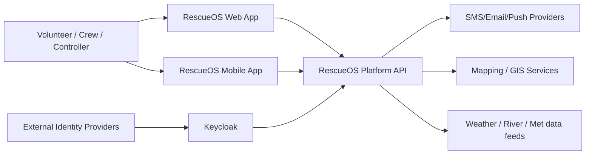
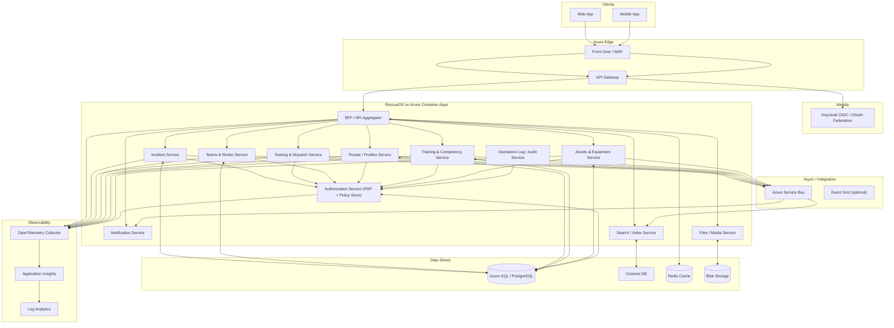
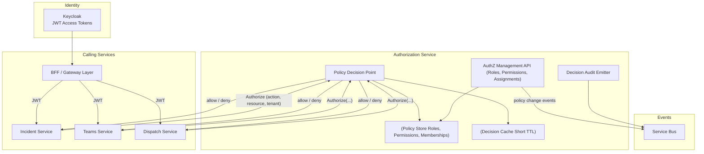

# RescueOS — Architecture (C4)

This document captures the **C4 architecture diagrams** for **RescueOS**, aligned with the agreed technical approach:

* Multi-tenant (organisations, teams, sub-teams)
* Azure Container Apps (ACA)
* Keycloak for authentication and federation
* Dedicated Authorization (AuthZ) service with team-defined roles and granular permissions
* API-first, microservice-based design

---

## C4 Level 1 — System Context

**Intent**
RescueOS is accessed via web and mobile applications. Users authenticate via **Keycloak**, which may federate to external identity providers. RescueOS integrates with external notification services, mapping/GIS providers, and environmental data sources.

---

## C4 Level 2 — Container Diagram

**Notes**

* Tenant isolation is logical, enforced via `tenant_id` and authorization policy rather than infrastructure isolation.
* Keycloak is responsible only for authentication and federation.
* All authorization decisions are centralised via the AuthZ service.
* Event-driven patterns decouple operational workflows (e.g. incident → notification → reporting).

---

## C4 Level 3 — Authorization Service (AuthZ) Components

### AuthZ Responsibilities

* Maintain tenant-defined roles and granular permissions
* Map users to roles within tenant/team scopes
* Evaluate authorization decisions consistently across services
* Provide auditable allow/deny decisions

### Policy Enforcement Points (PEP)

* Implemented as middleware in each service (e.g. Laravel middleware)
* Extract user identity and tenant context from request
* Call AuthZ PDP or use cached decisions
* Enforce allow/deny and apply scope restrictions

---

## Summary

These C4 diagrams describe how **RescueOS**:

* Supports multi-tenant SAR organisations
* Separates authentication from authorization
* Allows teams to define their own roles and permissions
* Scales cleanly on Azure Container Apps
* Remains observable, auditable, and maintainable

This document should be treated as the **baseline architectural reference** for RescueOS.
